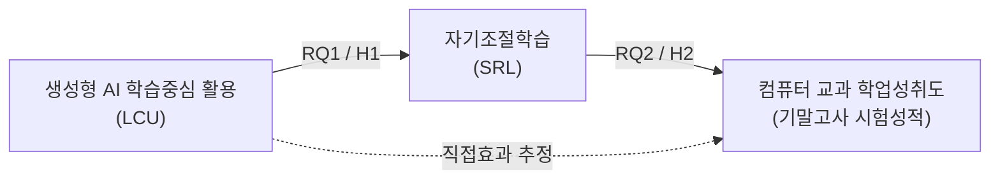

# 연구 기획

## 연구 주제

대학생의 생성형 AI 학습중심 활용(LCU)이 자기조절학습(SRL)을 통해 컴퓨터 교과 학업성취도와 어떻게 연결되는지 검증하는 연구

## 연구 문제

생성형 AI의 학습 활용은 단순한 사용 여부나 빈도보다 학습자가 AI를 어떠한 방식으로 활용하는지에 따라 학습과정과 결과가 달라질 수 있다. 본 연구에서는 생성형 AI의 학습중심 활용(Learning-Centred Use of GenAI, LCU)을 과제 중심적·검증 지향적·비대체적인 활용으로 보고, 이러한 활용이 이후 자기조절학습(Self-Regulated Learning, SRL)과 어떠한 관계를 갖는지 검증한다.

또한 SRL이 이후 컴퓨터 교과의 객관적 학업성취도와 어떠한 관계를 갖는지 확인하고, LCU와 학업성취도의 관계에서 SRL의 통계적 간접효과를 검증한다.

본 연구는 생성형 AI 활용의 인과적 효과를 직접 입증하는 것이 아니라, 시간적으로 구분된 측정자료를 이용하여 LCU, SRL, 학업성취도 간의 예측관계와 통계적 간접효과를 분석하는 데 초점을 둔다.

## 연구 질문

- RQ1. 대학생의 생성형 AI 학습중심 활용(LCU)은 이후 자기조절학습(SRL)을 정적으로 예측하는가?
- RQ2. 대학생의 자기조절학습(SRL)은 이후 컴퓨터 교과 학업성취도를 정적으로 예측하는가?
- RQ3. 생성형 AI 학습중심 활용(LCU)과 컴퓨터 교과 학업성취도의 관계에서 자기조절학습(SRL)의 통계적 간접효과는 유의한가?

## 연구 모형

연구모형의 핵심 검증 경로는 `LCU → SRL → 학업성취도`이다. 직접경로 `LCU → 학업성취도`는 간접효과 분석을 위해 함께 추정하되, 별도의 핵심 연구질문으로 설정하지 않는다.

화살표는 시간적으로 구분된 예측관계를 의미하며 인과관계를 확정하는 의미로 사용하지 않는다.

## 연구 가설

- H1. 대학생의 생성형 AI 학습중심 활용(LCU)은 이후 자기조절학습(SRL)을 정적으로 예측할 것이다.
- H2. 대학생의 자기조절학습(SRL)은 이후 컴퓨터 교과 학업성취도를 정적으로 예측할 것이다.
- H3. 생성형 AI 학습중심 활용(LCU)과 컴퓨터 교과 학업성취도의 관계에서 자기조절학습(SRL)의 정적 간접효과가 유의할 것이다.

## 연구 범위

본 연구는 한 대학의 컴퓨터 교과 수강 대학생을 대상으로 한다.

연구의 주요 변수는 다음과 같이 한정한다.

- 독립변수: 생성형 AI 학습중심 활용(LCU)
- 매개변수: 자기조절학습(SRL)
- 종속변수: 컴퓨터 교과의 기말고사 시험성적
- baseline 통제: LCU 이후 SRL을 분석할 때 초기 SRL 수준을 통제변수로 사용한다.

자료 수집은 변수 간 시간적 순서를 확보할 수 있도록 LCU와 이후 SRL의 측정시점을 분리하는 방향으로 설계한다. 초기 SRL은 LCU 측정과 같은 시점에 확보한다.

중간고사 성적을 baseline 학업성취 통제변수로 사용한다.

본 연구의 범위에는 다음 내용을 포함한다.

- 대학생의 생성형 AI 학습중심 활용 수준
- LCU와 이후 SRL의 관계
- SRL과 이후 컴퓨터 교과 학업성취도의 관계
- LCU와 학업성취도의 관계에서 SRL의 통계적 간접효과

다음 내용은 현재 연구 범위에서 제외한다.

- 생성형 AI 사용빈도 자체의 효과 검증
- LCU 이외의 생성형 AI 활용 유형 비교
- SRL 이외의 추가 매개·조절변수
- 다른 대학 또는 다른 교과목과의 비교
- 생성형 AI 서비스별 효과 비교
- 교수자의 생성형 AI 활용이나 교수법 효과
- 생성형 AI 활용의 인과적 효과를 직접 입증하는 것

설문자료와 시험성적은 학생 단위로 연결해야 하며, 연구 참여가 성적평가와 연결되어 인식되지 않도록 참여 동의 절차와 성적자료 결합 절차를 분리한다. [윤리 검토 필요]

연구자가 해당 과목의 담당교수이거나 성적평가에 관여하는 경우 참여 여부와 평가 과정이 분리되도록 절차를 구체화하고, 설문자료와 성적자료의 연결·보관·비식별화 방식은 기관의 연구윤리 및 개인정보보호 절차에 따라 검토한다. [윤리 검토 필요]
